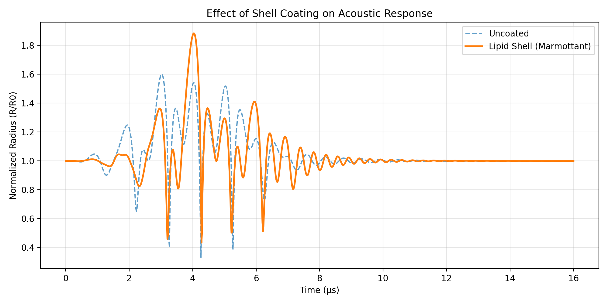

# jbubble

**Differentiable microbubble dynamics in JAX.**

[](https://github.com/imperial-nsb/jbubble/actions/workflows/ci.yml)
[](https://pypi.org/project/jbubble/)
[](https://pypi.org/project/jbubble/)
[](LICENSE)

<p align="center">
  
</p>
<p align="center">
  <em>Comparison of R(t) curves, with and without a lipid coating.</em>
</p>

---

jbubble is a research library for simulating and fitting acoustic microbubble
dynamics, built on [JAX](https://github.com/jax-ml/jax),
[Equinox](https://github.com/patrick-kidger/equinox), and
[diffrax](https://github.com/patrick-kidger/diffrax). Every simulation is fully
differentiable and JIT-compilable, enabling gradient-based parameter estimation,
batched parameter sweeps via `vmap`, and neural surrogate components — all from
the same model code.

Developed by the [Noninvasive Surgery & Biopsy Laboratory](https://www.imperial.ac.uk/non-invasive-surgery-biopsy) at Imperial College London.

## Why jbubble?

| Feature | jbubble | APECSS / MATLAB |
|---|---|---|
| JIT compilation | `jax.jit` | No |
| Vectorised sweeps | `jax.vmap` | Script loops |
| Gradient-based fitting | `jax.grad` | Finite differences |
| Composable physics | Mix any gas + shell + medium | Fixed combinations |
| Neural components | `NeuralProperty`, `NeuralPulse` | No |

## Installation

```bash
pip install jbubble
```

For development:

```bash
git clone https://github.com/imperial-nsb/jbubble.git
cd jbubble
pip install -e ".[dev]"
```

Requires Python &ge; 3.11. See the [installation guide](https://imperial-nsb.github.io/jbubble/guide/installation/) for GPU/TPU JAX setup.

## Quick start

### Using a preset

```python
import jax
from jbubble import run_simulation, SaveSpec
from jbubble.utils.presets import lipid_bubble

eom, pulse = lipid_bubble(R0=2e-6, freq=1e6, pressure=100e3)

result = jax.jit(run_simulation)(
    eom, pulse,
    save_spec=SaveSpec(num_samples=1000),
    t_max=10e-6,
)
print(result.radius.max() / eom.R0)  # peak expansion ratio
```

Three presets are available: `free_bubble`, `lipid_bubble`, and `thick_shell_bubble`.

### Composing models manually

```python
import jax
from jbubble import run_simulation, SaveSpec
from jbubble.bubble.eom import KellerMiksis
from jbubble.bubble.gas import PolytropicGas
from jbubble.bubble.shell import NoShell
from jbubble.bubble.medium import NewtonianMedium
from jbubble.pulse import ToneBurst
from jbubble.pulse.shapes import Sine

eom = KellerMiksis(
    gas=PolytropicGas(gamma=1.4),
    shell=NoShell(sigma=0.072),
    medium=NewtonianMedium(mu=1e-3),
    R0=2e-6, P_amb=101325.0, rho_L=998.0, c_L=1500.0,
)
pulse = ToneBurst(freq=1e6, pressure=100e3, shape=Sine(), cycle_num=5)

result = jax.jit(run_simulation)(
    eom, pulse,
    save_spec=SaveSpec(num_samples=1000),
    t_max=10e-6,
)
```

Any gas model works with any shell model and any medium model — all
combinations are valid and differentiated through automatically via `jax.grad`.

## Key capabilities

- **Composable physics** — Mix and match 6 equations of motion (Rayleigh-Plesset through Gilmore), 2 gas models, 3 shell models, and 4 medium models. All combinations work automatically.

- **Batch parameter sweeps** — Run thousands of simulations in parallel with `jax.vmap` and `GridSweep`:
  ```python
  sweep = GridSweep(fn=simulate, search_space={"R0": radii, "freq": freqs})
  results = sweep.run()  # shape (len(radii), len(freqs))
  ```

- **Gradient-based fitting** — Fit any model parameter to experimental data via `fit_parameters` and `optax`:
  ```python
  fit_result = fit_parameters(
      make_model=lambda p: (make_eom(p), pulse),
      params0=initial_guess,
      loss_fn=my_loss,
      optimizer=optax.adam(1e-2),
  )
  ```

- **Acoustic emissions** — Compute radiated pressure at arbitrary field points from solved trajectories using `IncompressibleMonopole` or `QuasiAcoustic` emission models.

## Examples

The [`examples/`](examples/) directory contains 12 self-contained scripts, ordered by complexity:

| # | Script | Description |
|---|--------|-------------|
| 00 | [Presets](examples/00_presets.py) | Quickest start — pick a preset and run |
| 01 | [Basic simulation](examples/01_basic_simulation.py) | Assemble an EoM from components manually |
| 02 | [Pulse algebra](examples/02_pulse_algebra.py) | Add, scale, and window pulse waveforms |
| 03 | [Shell models](examples/03_shell_models.py) | Compare no-shell, lipid, and thick-shell coatings |
| 04 | [Batch sweeps](examples/04_batch_sweeps.py) | `GridSweep` + `vmap` over parameter grids |
| 05 | [Parameter fitting](examples/05_fitting.py) | Gradient-based estimation of shell elasticity |
| 06 | [JIT timing](examples/06_jit_timing.py) | Benchmark JIT compilation vs steady-state throughput |
| 07 | [Cavitation regimes](examples/07_cavitation_regimes.py) | Stable vs inertial cavitation physics |
| 08 | [Acoustic emissions](examples/08_acoustic_emissions.py) | Monopole and quasi-acoustic radiated pressure |
| 09 | [Custom pulse shapes](examples/09_custom_pulse_shapes.py) | Subclass `FourierPulseShape` for custom waveforms |
| 10 | [Envelopes](examples/10_envelopes.py) | Envelope types and their gradient compatibility |
| 11 | [Gradient resonance](examples/11_gradient_resonance.py) | 2D sweep + gradient descent to resonance peak |

## Documentation

Full documentation is available at **[imperial-nsb.github.io/jbubble](https://imperial-nsb.github.io/jbubble/)**, including:

- [Quickstart guide](https://imperial-nsb.github.io/jbubble/guide/quickstart/)
- [Bubble models guide](https://imperial-nsb.github.io/jbubble/guide/bubble_models/)
- [JAX tips (JIT, vmap, grad)](https://imperial-nsb.github.io/jbubble/guide/jax_tips/)
- [API reference](https://imperial-nsb.github.io/jbubble/api/)

## Contributing

Contributions are welcome! Please see [CONTRIBUTING.md](CONTRIBUTING.md) for guidelines.

## License

MIT License. Copyright (c) 2026 Noninvasive Surgery & Biopsy Laboratory.
See [LICENSE](LICENSE) for details.
